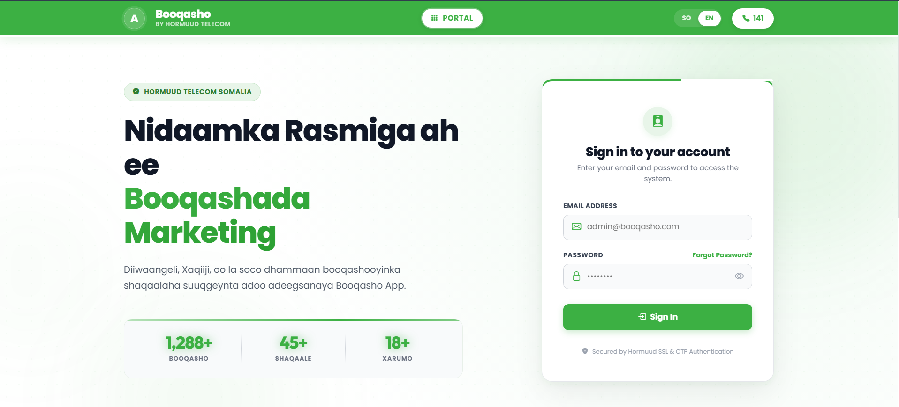

# Booqasho App — Marketing Visit Management System

> **Booqasho** (meaning "Visit" in Somali) is a field marketing management platform by **Hormuud Telecom** that helps you track, verify, and report on every client visit your team makes.

---

## What It Does

Marketing teams spend most of their time in the field — visiting shops, businesses, schools, and hospitals. Booqasho App replaces paper logs and spreadsheets with a **digital system** that records every visit, including:

- **Where** the visit happened (with address details)
- **Who** was met (contact person, phone number)
- **Why** the visit was made (purpose, activities, offers presented)
- **What happened** (successful deal, follow-up needed, or declined)

---

## How It Works

### 1. Secure Login

Each team member signs in with their company email and password. Admin users can manage who has access to the system.

### 2. Log a Visit

When a field agent visits a client, they open the app and fill in a simple form:
- Establishment name and type (shop, school, hospital, etc.)
- Contact person details
- Date and time of visit
- Purpose and activities performed
- Visit outcome (Successful / Pending / Failed)

No paper, no lost data — everything is saved instantly.

### 3. Track Performance

Managers and administrators get a **live dashboard** showing:
- Total visits logged across the team
- Success rates per employee
- Weekly activity trends
- Visit status distribution (successful, pending, failed)
- Recent audit logs for full accountability

### 4. Export Reports

Generate professional reports in **Excel** or **CSV** format with a single click. Filter by date range, employee, status, or establishment type.

---

## Who It's For

| Role | What They See |
|------|---------------|
| **Field Marketing Agents** | Log visits, view their own history and performance |
| **Marketing Managers** | Dashboard overview, team KPIs, visit details |
| **Administrators** | Full access: manage users, approve visits, export reports |

---

## Key Features

- **GPS-Verified Visits** — Each visit is logged with location data
- **SMS OTP Security** — Two-factor authentication protects accounts
- **Dark & Light Mode** — Switch themes to suit your preference
- **Somali & English** — Full bilingual interface
- **Real-Time Dashboard** — See team performance as it happens
- **One-Click Reports** — Export data to Excel or CSV instantly

---

## Quick Start

**For first-time use, contact your system administrator to create your account.**

1. Open the app in your browser at the company-provided link
2. Sign in with your email and password (provided by your admin)
3. Start logging your field visits from the **Log Visit** page
4. View your performance on the **Dashboard**

---

> Built for **Hormuud Telecom** — Somalia's leading telecommunications company.
